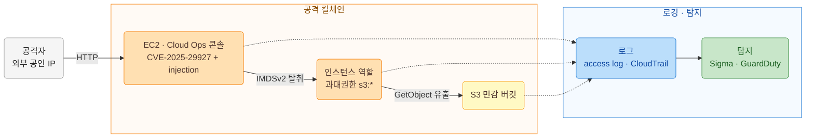
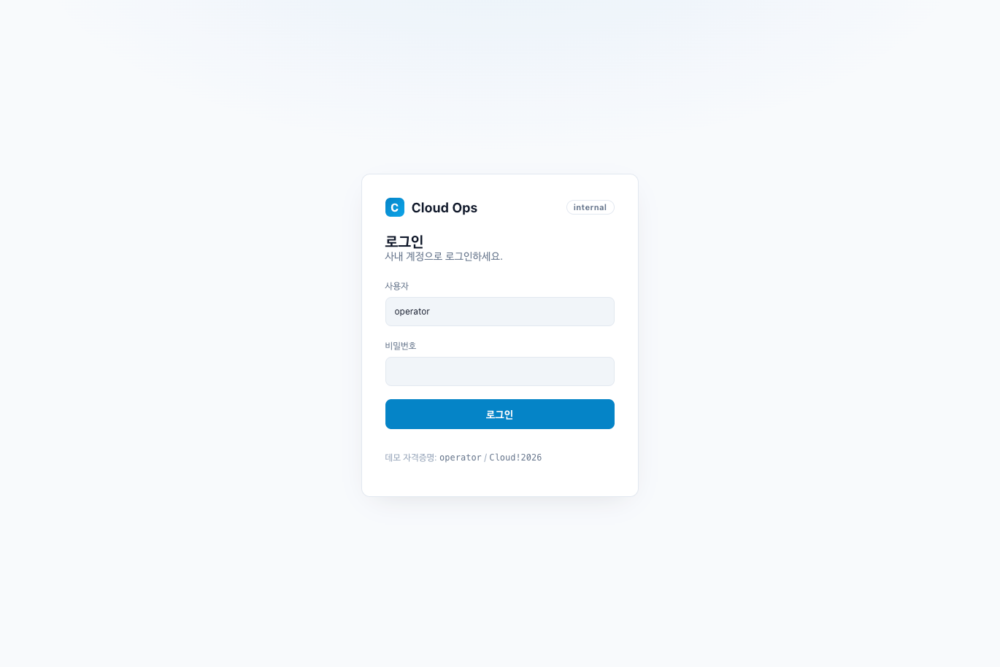
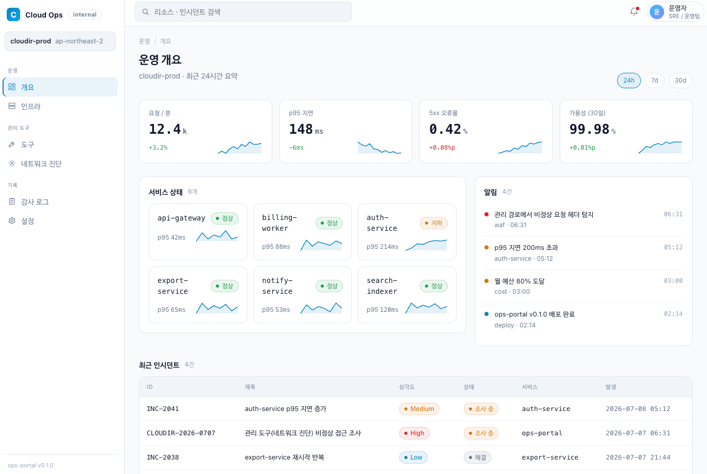
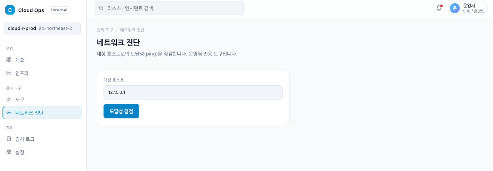

# AWS 침해사고 재현·분석·탐지

> **CVE-2025-29927 인증 우회 + command injection → RCE → root 상승 → IMDSv2 자격증명 탈취 → S3 데이터 유출**
> 체류 약 7분 16초 · 전 과정 IaC로 재현 · CloudTrail/Flow Logs/호스트 로그로 타임라인 재구성

| 항목 | 내용 |
|------|------|
| 사고 ID | `CLOUDIR-2026-0709` |
| 킬체인 | Next.js 미들웨어 우회 + RCE → sudo `find` privesc → IMDSv2 자격증명 탈취 → 오프박스 API 오용 → S3 유출 |
| ATT&CK | T1190 · T1059.004 · T1548.003 · T1552.005 · T1078.004 · T1580 · T1619 · T1530 |
| 탐지 커버리지 | Sigma 룰 3종 + Athena/CloudWatch Insights 쿼리 + GuardDuty 매핑 |
| 성과 | 체류 7분 16초, 유출 객체 2건 식별, 근본원인 5연쇄 규명, 표준 IR 10섹션 보고서 |



AWS 침해사고 분석 환경을 코드로 구축하고, 하이브리드 킬체인(Linux 침투 → IAM 자격증명 탈취 →
AWS API 오용 → S3 유출)을 직접 재현하고 분석·탐지해 침해사고 분석 보고서로 정리했다. 클라우드
인프라 운영 경험을 침해사고 대응(DFIR) 쪽으로 넓혀보려고 만든 프로젝트다.

## 개요

- 목표: 클라우드 침해사고의 전체 흐름(구축 → 공격 → 분석 → 탐지 → 보고)을 코드와 문서로 남기기
- 시나리오: Cloud Ops 사내 운영 콘솔의 네트워크 진단 도구(미들웨어 뒤 관리 API)를 노린
  CVE-2025-29927 인증 우회 + command injection → RCE(비권한 nextjs) → sudo `find` privesc(root)
  → IMDSv2 자격증명 탈취 → 과대권한 오용 → S3 데이터 유출
- 결과: 최초 침투부터 유출까지 체류 약 7분 16초. CloudTrail/Flow Logs/호스트 로그로 타임라인을
  다시 맞췄고, 핵심 탐지 신호(인스턴스 역할 자격증명이 인스턴스 밖에서 쓰인 정황)를 확인했다

## 아키텍처

`docs/architecture.md` 참조(구성도 + 취약 요소 + 공격 경로). 요약:

```
공격자 → [EC2 Cloud Ops 콘솔(취약 Next.js), IMDSv2] --우회+RCE+privesc+탈취--> [IAM 과대권한] --> [S3 민감버킷]
로깅: CloudTrail(S3 데이터 이벤트) + VPC Flow Logs(CloudWatch)
```

## 스크린샷

Cloud Ops 사내 운영 콘솔 주요 화면.

### 로그인


### 운영 개요 대시보드 (KPI · 서비스 상태 · 알림 · 최근 인시던트)


### 관리 도구 > 네트워크 진단 (취약 도구)


## 레포 구조

```
.
├── terraform/    # 분석 환경 IaC (VPC, 취약 EC2/IMDSv2, 과대권한 IAM, sudo 오구성, S3, CloudTrail, Flow Logs, SSM)
├── app/          # 취약 Next.js 웹앱 - Cloud Ops 사내 콘솔(개요/인프라/관리도구/감사/설정), 진단도구가 취약(CVE-2025-29927 + injection)
├── attack/       # 킬체인 재현 플레이북 + 스크립트 (MITRE ATT&CK 매핑)
├── analysis/     # 로그 수집/정규화/헌팅 + 타임라인·근본원인·IOC
├── detection/    # Sigma 룰, Athena/Insights 쿼리, GuardDuty 매핑, 하드닝
├── report/       # 실무형 침해사고 분석 보고서 + 위협 인텔 브리프
└── docs/         # 아키텍처, 실행권한 정책
```

## 재현 방법

전제: 본인 소유 격리 AWS 계정, Terraform >= 1.14, aws-cli, python3.

```bash
# 1) 분석 환경 배포
cd terraform
cp terraform.tfvars.example terraform.tfvars   # my_ip 등 편집
terraform init && terraform apply

# 2) 공격 재현 (침해 로그 생성)
cd ../attack
export TARGET_IP=$(terraform -chdir=../terraform output -raw web_public_ip)
bash scripts/01_rce.sh && bash scripts/02_privesc.sh && bash scripts/03_imds.sh
source stolen/creds.env && bash scripts/04_exfil.sh

# 3) 분석 (분석자 자격증명으로. 공격 후 stolen creds는 unset)
cd ../analysis
unset AWS_ACCESS_KEY_ID AWS_SECRET_ACCESS_KEY AWS_SESSION_TOKEN
bash collect/collect_all.sh
python3 parse/normalize.py && python3 parse/hunt.py
# 공유용 스크린샷: python3 parse/hunt.py --mask (IP/UA/키/계정 ID 마스킹)
# KST로 확인: python3 parse/hunt.py --kst (원본은 UTC 유지, --mask와 조합 가능)

# 4) 종료 후 정리
cd ../terraform && terraform destroy
```

상세: `terraform/README.md`(runbook), `attack/README.md`, `analysis/README.md`.

## 배운 점

- 유출은 취약점 하나가 아니라 여러 결함이 겹쳐서 생겼다(미들웨어 단독 인증 + CVE-2025-29927 +
  입력 미검증 + sudo 오구성 + IAM 과대권한). 그래서 이 중 한 고리만 끊어도 막을 수 있었다.
- IMDSv2는 SSRF는 잘 막지만 완전한 RCE 앞에서는 한계가 있었다. 유출 규모를 실제로 줄인 건 IAM
  최소권한이었다. 공격 벡터마다 먹히는 통제가 다르다는 걸 눈으로 확인했다.
- CloudTrail S3 데이터 이벤트 로깅을 켜두지 않았으면 GetObject 유출 자체가 로그에 안 남았을
  것이다. 가시성은 사고가 나기 전에 설계해둬야 한다.
- 분석할 때 공격자 자격증명과 분석자 자격증명을 섞으면 안 된다. 탈취한 자격증명이 셸에 남은 채로
  수집 스크립트를 돌렸다가 오탐 이벤트를 만든 적이 있는데, 탐지 이벤트는 "누가 왜 했는지" 맥락이
  같이 있어야 판단이 된다.

## 안전/윤리 고지

모든 공격 행위는 작성자 본인 소유의 격리된 AWS 계정에서 교육과 방어(디지털 포렌식/침해대응)
목적으로만 진행했다. S3에 올린 민감 데이터는 전부 합성 더미라 실제 개인정보가 없고, 문서에 나오는
공격자 IP와 자격증명은 마스킹했다. 검증이 끝나면 모든 자원은 `terraform destroy`로 지운다.
