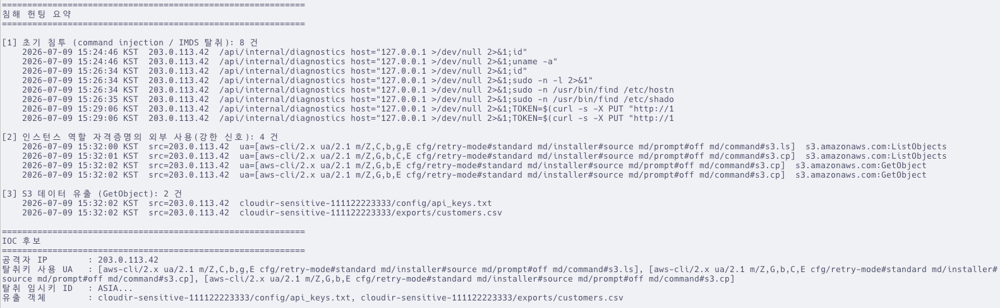

# 침해사고 분석

공격 단계에서 생성된 로그를 수집·정규화하고, 침해 신호를 헌팅해 타임라인/근본원인/IOC를
도출한다. 표준 라이브러리만 사용하므로 별도 설치가 필요 없다(python3, aws cli만 있으면 됨).

## 전제

- 분석 환경이 apply된 상태이고, 공격 스크립트(`attack/`)를 실행해 로그가 쌓였다.
- EC2 역할에 SSM 정책이 붙어 있다(`terraform apply` 반영). 에이전트 등록에 1~2분 걸린다.
- CloudTrail은 이벤트 전달까지 최대 15분 지연되므로, 유출 직후 바로 안 보이면 잠시 후 재수집.
- 수집·분석은 본인 프로파일로 실행한다. 공격 직후엔 탈취 키가 셸에 남아 있을 수 있으니
  `aws sts get-caller-identity`로 본인 사용자인지 확인하고(arn에 `assumed-role/cloudir-ec2-role`이
  보이면 탈취 키가 활성), 필요하면 `unset AWS_ACCESS_KEY_ID AWS_SECRET_ACCESS_KEY AWS_SESSION_TOKEN`
  후 진행한다. 탈취 역할로 수집하면 SSM 호스트 로그 수집이 막히고 CloudTrail도 오염된다.

## 실행 (analysis/ 에서)

```bash
cd analysis
bash collect/collect_all.sh      # host(SSM) + CloudTrail(S3) + Flow Logs -> raw/
python3 parse/normalize.py       # raw/ -> normalized.csv (시간순 통합 이벤트)
python3 parse/hunt.py            # 침해 신호 헌팅 + IOC 요약 (시각 UTC)
python3 parse/hunt.py --mask     # 공유용: 민감값(IP/UA/키/계정 ID) 마스킹 출력
python3 parse/hunt.py --kst      # 시각을 KST(UTC+9)로 표시 (원본 UTC는 그대로, --mask와 조합 가능)
```

> 원본(로그·`normalized.csv`·`hunt.py` 기본 출력)은 UTC로 유지한다. 서술 문서(`timeline.md`·
> `incident-report.md`)는 가독성을 위해 KST로 표기하며, `--kst`는 hunt.py 출력을 동일하게 KST로 바꾼다
> (헌팅 로직·저장값에는 영향 없음, `--mask`와 동일한 출력-시점 변환).

## 산출물

- `raw/` : 원본 로그 (gitignore, 민감 값 포함 가능)
- `normalized.csv` : 공통 스키마(ts, source, src_ip, actor, action, target, user_agent, detail)로
  통합·정렬된 이벤트 (gitignore)
- `hunt.py` 출력 : 3가지 신호 요약
  1. 초기 침투(command injection / IMDS 탈취) - host 웹 로그
  2. 인스턴스 역할 자격증명의 외부 사용 - CloudTrail sourceIPAddress가 공격자 IP
  3. S3 데이터 유출(GetObject) - CloudTrail 데이터 이벤트

`python3 parse/hunt.py --mask --kst` 출력 예시(민감값 마스킹, 시각 KST):



## 다음 (손으로 작성)

`hunt.py` 결과를 근거로 아래를 작성한다(민감 값은 마스킹해 커밋):

- `timeline.md` : 초기 침투 -> 탈취 -> 정찰 -> 유출 시각순 재구성(각 항목에 로그 근거 인용)
- `root_cause.md` : 미들웨어 단독 인증 + CVE-2025-29927 + command injection + sudo 오구성 + IAM 과대권한의 결합
- `iocs.md` : 공격자 IP, User-Agent, 탈취 임시키 ID, 유출 객체, 악용 API

## 분석 포인트

- 가장 강력한 탐지 신호는 "인스턴스 역할 자격증명이 EC2가 아닌 외부 IP에서 쓰인 것"이다.
  정상적으로 EC2 인스턴스 자격증명은 인스턴스 내부에서만 사용된다.
- IMDS 접근 자체는 CloudTrail에 남지 않으므로, 탈취 시점은 host 웹 로그의 IMDS 호출 흔적과
  이후 첫 API 사용 시각으로 역추적한다.
