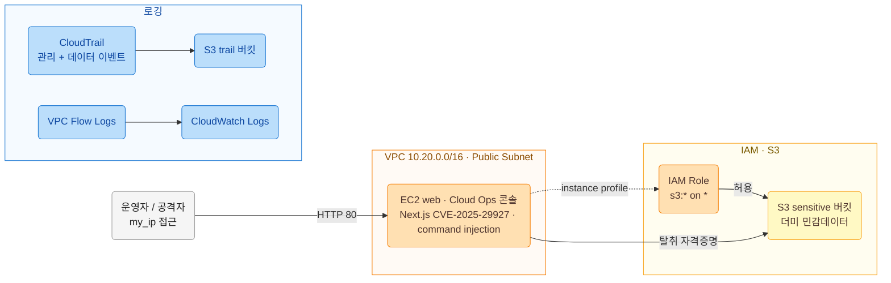

# 아키텍처

## 구성도

## 취약 요소 (의도적으로 심은 근본 원인)

| 요소 | 설정 | 왜 취약한가 |
|------|------|-------------|
| 웹 앱 인증 | 미들웨어 단독 인증 + Next.js 15.1.6 | CVE-2025-29927: 위조 `x-middleware-subrequest`로 미들웨어 우회 → 미인증 접근 |
| 웹 앱 진단 API (콘솔 관리 도구 > 네트워크 진단) | `/api/internal/diagnostics`의 `host`를 셸에 그대로 전달 | command injection으로 원격 코드 실행(RCE, 비권한 nextjs) |
| sudo 설정 | `nextjs ALL=NOPASSWD: /usr/bin/find` | GTFOBins(`find -exec`)로 nextjs→root 권한 상승 |
| EC2 IMDS | `http_tokens = "required"` (IMDSv2) | 온박스 RCE 앞에서는 토큰 직접 발급으로 자격증명 탈취 가능(IMDSv2도 완전 방어 불가) |
| IAM 역할 | `s3:*` on `*` | 최소권한 위반, 탈취 시 유출 범위 확대 |

## 공격 경로(요약)

1. 운영자 IP에서 위조 `x-middleware-subrequest`로 미들웨어 우회(CVE-2025-29927) 후 `/api/internal/diagnostics` command injection으로 RCE 확보(비권한 nextjs)
2. sudo `find` GTFOBins로 nextjs→root 권한 상승
3. RCE로 IMDSv2(토큰 발급 후 조회)에서 EC2 역할 임시 자격증명 탈취
4. 탈취 키로 AWS API 정찰(`sts:GetCallerIdentity`, `s3:ListBucket`)
5. 과대권한을 이용해 S3 민감 버킷에서 데이터 유출(`s3:GetObject`)

상세 킬체인과 MITRE ATT&CK 매핑은 `attack/` 참조.

## 로깅(분석 근거)

- CloudTrail: 관리 이벤트 + S3 오브젝트 데이터 이벤트(유출 GetObject 포착)
- VPC Flow Logs: 서브넷 트래픽(외부 유출/C2 흔적)
- EC2 로컬: 웹 access log(`/var/log/webapp/access.log`, `mws`/`host` 필드), sudo/auth 로그, journald
